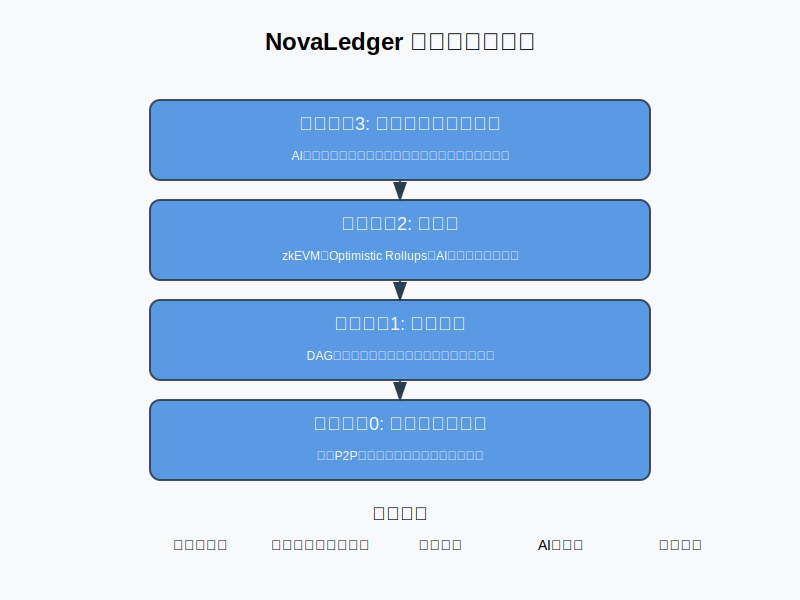

# NovaLedger - 究極のブロックチェーン技術

[](https://app.netlify.com/sites/novaledger/deploys)
[](https://github.com/enablerdao/NovaLedger/stargazers)
[](https://github.com/enablerdao/NovaLedger/network/members)
[](https://github.com/enablerdao/NovaLedger/issues)
[](https://github.com/enablerdao/NovaLedger/blob/main/LICENSE)

> **開発進捗状況**: コンセプト段階 | ウェブサイト実装中 | 25ファイル | 最終更新: 2025年3月
>
> NovaLedgerは現在コンセプト段階のプロジェクトで、主にウェブサイトとドキュメントの開発が進行中です。アーキテクチャ設計とホワイトペーパーの作成が完了し、プロトタイプ開発の準備が整っています。コミュニティ形成も開始されています。

<p align="center">
  
</p>

```
 _   _                _          _
| \ | | _____   ____ | |    ___  __| | __ _  ___ _ __
|  \| |/ _ \ \ / / _` | |   / _ \/ _` |/ _` |/ _ \ '__|
| |\  | (_) \ V / (_| | |__|  __/ (_| | (_| |  __/ |
|_| \_|\___/ \_/ \__,_|_____\___|\__,_|\__, |\___|_|
                                       |___/
```

NovaLedgerは、次世代のブロックチェーン技術を実現するコンセプトプロジェクトです。超高速処理、高スケーラビリティ、ゼロ遅延決済、最小手数料、究極の分散性、量子耐性、AIによる最適化など、現在のブロックチェーン技術の限界を超える革新的な機能を提案しています。

## 主な特徴

- **超高速処理**: 100,000 TPS以上の処理能力
- **高スケーラビリティ**: シャーディング＋ロールアップ併用
- **ゼロ遅延決済**: 即時ファイナリティを実現
- **最小手数料**: マイクロトランザクションも低コスト
- **究極の分散性**: 真の非中央集権化を実現
- **量子耐性**: 将来の量子コンピュータにも対応
- **AI最適化**: AIによるスマートコントラクト最適化
- **環境配慮**: BTC比99.99%以上の省エネ達成

## 独自のコンセンサスアルゴリズム: Proof of Nova (PoN)

<p align="center">
  
</p>

PoNは、PoSの経済的インセンティブ、DAGの非同期性、PoHのタイムスタンプ管理の長所を融合した革新的なコンセンサスアルゴリズムです。ランダム選出されたバリデーターグループが同時並行的にブロックを生成し、DAG構造を活用してコンフリクトを回避します。さらに、AIが信頼度スコアを継続的に最適化し、MEV対策としてバリデータごとのブロック提案をランダム化します。

### PoNの主要コンポーネント

1. **ステークベースの選出メカニズム**: バリデーターはステーク量に応じて選出確率が決定されますが、単純な比例関係ではなく、二次関数的な重み付けにより、大規模ステーカーの支配を防止します。

2. **DAG型ブロック構造**: 従来の直線的なブロックチェーンではなく、有向非巡回グラフ（DAG）構造を採用し、複数のバリデーターが同時にブロックを生成できるようにします。これにより、スループットが大幅に向上します。

3. **時間証明システム**: PoHに似た暗号学的時間証明を使用して、トランザクションの順序を確定し、二重支払いを防止します。

4. **AI信頼度スコアリング**: 機械学習アルゴリズムがバリデーターの過去の行動を分析し、信頼度スコアを算出します。このスコアはバリデーター選出の際の重要な要素となります。

## 多層アーキテクチャ

NovaLedgerは4つの層から構成されています：

```
┌─────────────────────────────────────────────────────────┐
│ レイヤー3: アプリケーション層                            │
│ AI支援型スマートコントラクト・リアルタイム最適化         │
├─────────────────────────────────────────────────────────┤
│ レイヤー2: 拡張性                                       │
│ zkEVM・Optimistic Rollups・AIオプティマイザー           │
├─────────────────────────────────────────────────────────┤
│ レイヤー1: ベース層                                     │
│ DAG型マルチチェーン構造・シャーディング                  │
├─────────────────────────────────────────────────────────┤
│ レイヤー0: ネットワーク層                               │
│ 独自P2Pプロトコル・動的ルーティング                      │
└─────────────────────────────────────────────────────────┘
```

1. **レイヤー0（ネットワーク層）**: 独自のP2Pプロトコルと動的ルーティングによる遅延最小化
   - **高速メッセージング**: 最適化されたゴシッププロトコルによる効率的なメッセージ伝播
   - **動的ルーティング**: ネットワーク状態に応じて最適な経路を自動選択
   - **地理的最適化**: 物理的な距離を考慮したノード間通信の最適化

2. **レイヤー1（ベース層）**: DAG型マルチチェーン構造とシャーディングによる超高スケーラビリティ
   - **適応型シャーディング**: ネットワーク負荷に応じて動的にシャード数を調整
   - **クロスシャード通信**: 効率的なシャード間データ交換プロトコル
   - **DAG構造**: 並列処理を可能にする有向非巡回グラフ構造

3. **レイヤー2（拡張性）**: zkEVM、Optimistic Rollups、AIオプティマイザーによる低コスト高速処理
   - **zkEVM**: ゼロ知識証明を用いたEVM互換の高速処理環境
   - **Optimistic Rollups**: オフチェーン処理による高スループット
   - **AIオプティマイザー**: 機械学習による最適なロールアップ戦略の選択

4. **レイヤー3（アプリケーション層）**: AI支援型スマートコントラクトとリアルタイム最適化
   - **AI支援開発**: スマートコントラクト作成を支援するAIツール
   - **自動最適化**: 実行時にコントラクトを自動的に最適化
   - **セキュリティ検証**: AIによるリアルタイムセキュリティ分析

## セキュリティとプライバシー

- **量子耐性暗号**: Post-Quantum Cryptography (PQC)を全面的に導入
  - **格子ベース暗号**: CRYSTALS-Dilithium、CRYSTALS-Kyberなどの実装
  - **ハッシュベース署名**: SPHINCS+などの量子耐性署名スキーム
  - **段階的移行計画**: 既存の暗号システムから量子耐性暗号への円滑な移行

- **ゼロ知識証明**: zk-SNARK、zk-STARKを全ノードに実装
  - **プライバシー保護トランザクション**: 送信者、受信者、金額を秘匿化
  - **効率的な検証**: 最小限の計算リソースで検証可能
  - **選択的開示**: ユーザーが開示する情報を選択可能

- **AIベース不正検知**: ノードの挙動を常時監視し、不審行動を即座に排除
  - **異常検出アルゴリズム**: 通常のネットワーク動作からの逸脱を検出
  - **行動パターン分析**: バリデーターの過去の行動から不正パターンを学習
  - **リアルタイム対応**: 不正行為の検出と対応を即時実行

## 革新的なガバナンス: AIサポート型DAO (AIDAO)

従来のDAOを超えた新しいガバナンスモデルとして、AIが客観的データ、経済学的妥当性、ネットワークの健全性を考慮した上で、コミュニティの意思決定を支援します。Quadratic Votingを採用し、トークンホルダーが公平に参加できる仕組みを提供します。

### AIDAOの主要機能

- **提案分析**: AIが提案の技術的実現可能性、経済的影響、セキュリティリスクを分析
- **シミュレーション**: 提案された変更の影響をシミュレーションし、結果を可視化
- **投票最適化**: Quadratic Votingと評判システムを組み合わせた公平な投票メカニズム
- **自動実装**: 承認された提案の自動的なコード生成と実装支援

## トークノミクス

メイントークン「NOVA（NVL）」は、ネットワークの利用料、バリデータ報酬、ガバナンス参加に使用されます。インフレ率はAIが経済活動に応じて動的に調整し、年間1-3%前後に維持されます。

### トークン配分

- **エコシステム開発**: 30%
- **バリデーター報酬**: 25%
- **コミュニティ報酬**: 20%
- **開発チーム**: 15%
- **戦略的パートナー**: 10%

### 経済モデル

- **動的手数料構造**: ネットワーク負荷に応じて自動調整される手数料システム
- **ステーキング報酬**: ステーク量と貢献度に基づく報酬分配
- **バーン機構**: 手数料の一部を自動的にバーンし、デフレ圧力を維持

## 開発者向けツール

- EVM互換＋WASMベースのスマートコントラクト両対応
- AIによるコード自動生成・最適化
- No-codeおよびLow-code環境
- ウォレット・マーケットプレイス・DEX・DeFiモジュールの標準提供

### 開発キット

- **NovaSDK**: 多言語対応の開発キット（Rust, Go, JavaScript, Python）
- **NovaIDE**: AIアシスタント機能を備えた統合開発環境
- **NovaTest**: シミュレーション環境とテストフレームワーク
- **NovaDeploy**: ワンクリックデプロイメントツール

## エコシステム展開

NFTマーケットプレイス、DEX、DeFi、メタバース、ゲーミング、IoT、医療データ管理など、幅広い実世界アプリケーションへの適応を目指しています。

### 重点分野

- **金融**: 高速・低コストの決済システム、分散型取引所、合成資産
- **ゲーム・メタバース**: オンチェーンゲーム、デジタル資産管理、仮想世界
- **IoT**: センサーデータの検証、M2M決済、自律システム
- **医療**: プライバシー保護された医療データ共有、研究データ管理

## ウェブサイトの起動方法

このリポジトリをクローンした後、以下のコマンドでウェブサーバーを起動できます：

```bash
cd NovaLedger/frontend
npm install
npm run dev
```

その後、ブラウザで表示されるURLにアクセスしてください。

## 免責事項

NovaLedgerは現時点ではコンセプト段階のプロジェクトであり、実際の実装はまだ行われていません。このリポジトリは、NovaLedgerのビジョンと可能性を示すためのデモンストレーション目的で作成されています。

## ライセンス

© 2025 NovaLedger. All rights reserved.

## 関連プロジェクト

EnablerDAOが開発する他のブロックチェーンプロジェクトもご覧ください：

- [NexaCore](https://github.com/enablerdao/NexaCore) - AI統合、シャーディング、zk-SNARKsを特徴とする次世代ブロックチェーンプラットフォーム
- [OptimaChain](https://github.com/enablerdao/OptimaChain) - 革新的なスケーリング技術と高度なセキュリティを統合した分散型ブロックチェーンプラットフォーム
- [NeuraChain](https://github.com/enablerdao/NeuraChain) - AI、量子耐性、スケーラビリティ、完全な分散化、エネルギー効率を統合した次世代ブロックチェーン
- [PulseChain](https://github.com/enablerdao/PulseChain) - リアルタイム処理、環境融合、人間性を重視した全く新しいレイヤーワンブロックチェーン
